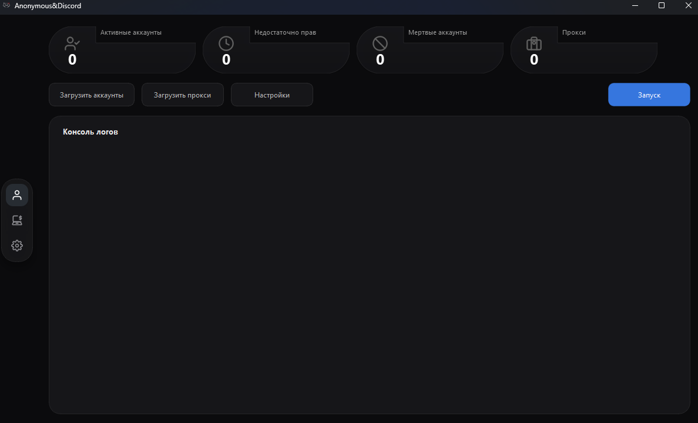
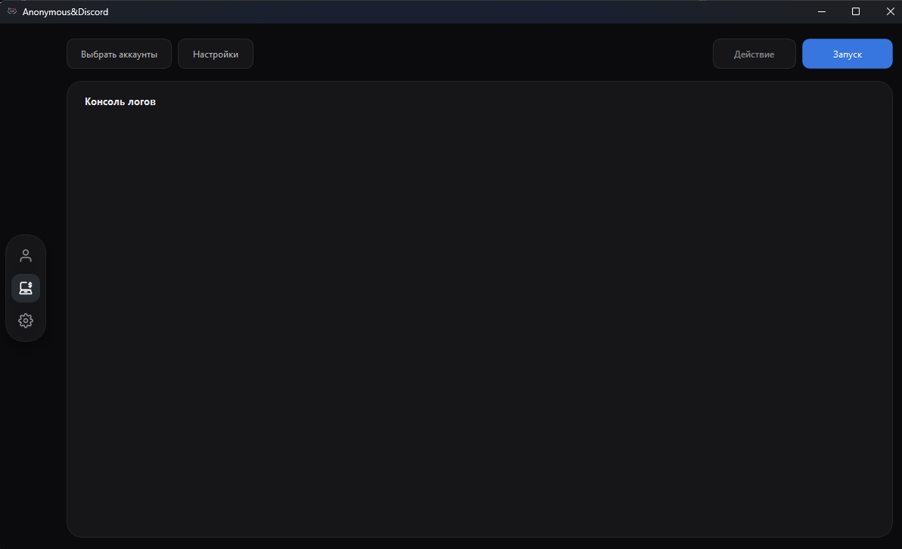
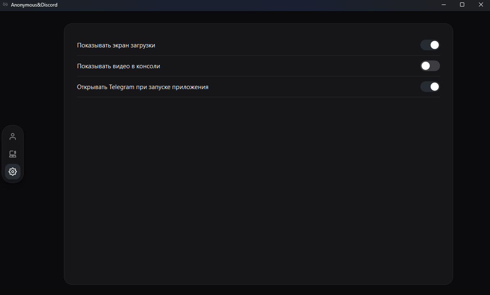

<h1 align="center">Anonymous&Discord</h1>

<p align="center">Десктопное приложение на <code>PyQt6</code> для работы с Discord-аккаунтами, токенами, прокси и массовой отправкой сообщений.</p>

<p align="center">
  
</p>

<p align="center">
  
  
  
  
</p>

---

## Features

| Module | Description |
| --- | --- |
| Checker | Проверка токенов на валидность |
| Checker | Поддержка прокси |
| Broadcast | Массовая отправка сообщений по аккаунтам |
| Broadcast | Работа с вложениями |
| UI | Управление аккаунтами и прокси |

---

## Screenshots

<table>
  <tr>
    <td align="center">
      
      <br />
      <sub>Accounts</sub>
    </td>
    <td align="center">
      
      <br />
      <sub>Action</sub>
    </td>
  </tr>
  <tr>
    <td align="center">
      
      <br />
      <sub>Settings</sub>
    </td>
    <td align="center">
      <div></div>
    </td>
  </tr>
</table>

---

## Технологический стек

* **Core / Async:** `Python 3.13`, `aiohttp`, `aiofiles`
* **Proxy Support:** `aiohttp-socks` (SOCKS4, SOCKS5, HTTP)
* **GUI Framework:** `PyQt6` (кастомные стили, кастомные виджеты)
* **Video / Graphics:** `PyAV`, `NumPy` (для рендера видео-фона)

---

## Структура проекта

```bash
DISCORD-AUTO/
│
├── main.py
│
├── src/
│   ├── core/
│   ├── ui/
│   └── workers/
│
├── assets/
├── data/
└── checks/
```

---

## Установка и запуск

```bash
python -m venv .venv
.venv\Scripts\activate
pip install -r requirements.txt
python main.py
```

Если при запуске возникают ошибки, связанные с `av`, установи FFmpeg в систему и добавь его в `PATH`.

---

## Примечания

- При первом запуске база данных создается автоматически.
- Все основные настройки сохраняются локально в `data/app.db`.

---
